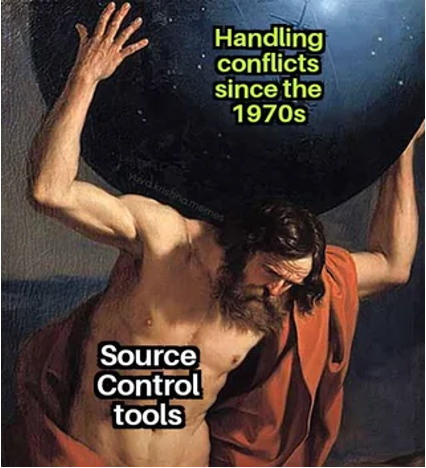
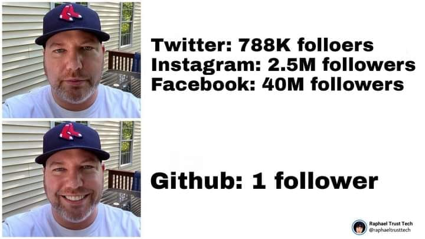
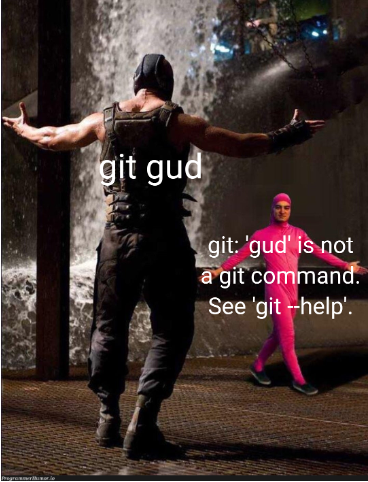
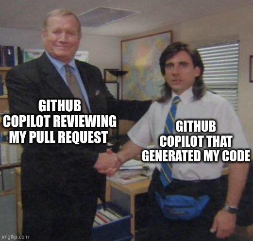

# A Scholar's Introduction to Git and GitHub



Ian G. Williams and Zhilang Liu

GC Digital Fellows


September 16, 2026

# Intended Time Commitment
1.5-2 hours

## Description

From storing hand-coded websites and data repositories to sharing vibe-coded apps, GitHub is a central pillar of today's digital scholarship infrastructure. An online platform for storing and sharing code, text, and data, it is also used to host and display websites and digital tools, track contributions to shared projects, and examine as a site of cultural data and collective memory. GitHub is built on the version control software Git, and here we will introduce and review both. This workshop explores the history, foundations, and fundamentals of Git and GitHub and offers some practical exercises for getting started. The workshop will also examine case studies and scholarly projects that used Github as a source of data and a field site. This workshop is designed for beginners and is suitable for researchers in any discipline. Prior knowledge of GitHub/programming is not required. If you would like to follow along with the applied part of the workshop, you are encouraged to create a free GitHub account (https://github.com/) before attending. It is advised that you bring your own laptop computer to this workshop.

## Longer Description

This workshop is a Open Educational Resource that provides an  overview of version control, Git, and GitHub. It is intended as a practical, and thorough, lesson that also encourages scholarly examinations of the technologies, their platforms, and practices as sites and objects of research. It incorporates brief quizzes and practical exercises. The intended audience are graduate students with limited to no exposure to Git and GitHub, although it may be informative for students familiar with these software tools, who may have learned in a less systematic way. The workshop provides foundational knowledge that will help the users understand how to interact with core pieces of Internet infrastructure. For participants who use agentic and automated workflows for Git and GitHub, this knowledge will assist them in designing, improving, and troubleshooting those processes.

This is a living document and will be further revised after the in person workshop session on 9/15/2026.

## Workshop Plan

This workshop will largely follow the lesson plan on Digital Humanities Resource Infrastructure for Teaching Technology (DHRIFT), a project developed by GC Digital Initiatives, which GC Digital Initiatives use for the GC Digital Research Institute. Here we will not complete the entire lesson during the allotted workshop time. Participants are encouraged to complete the remainder on their own. The lesson can be followed along in your browser here:

https://app.dhrift.org/v2?user=GC-DRI&repo=DRI24&file=git&branch=main&page=1&instUser=GC-DRI&instRepo=GCDRI24Schedule

For this lesson we will cover sections from the DHRIFT lesson, starting at *Frontmatter*, leading up to *Staging and Committing Changes*. What this means is that we will cover the background and conceptual overview of version control, Git, and GitHub. We will then cover practical exercises in Git using the Command Line.

Further sections, *Pushing To GitHub*, *Cloning and Forking*, and *Theory To Practice* will be completed as a self-study.

### Adjustments to DHRIFT lesson plan

The original DHRIFT workshop is designed with the assumption that users would have [VS Code](https://code.visualstudio.com/) installed, which makes it easiest to integrate with a GitHub workflow and preview Markdown used for the mock syllabus exercise. This is relevant to the ***Creating A Syllabus File*** section of the DHRIFT lesson.

If you do not have VS Code installed at the start of this, an alternative route is to use a native plain text editor from within the command line. In that instance, we'll use [**Nano**](https://www.nano-editor.org/), a freeware text-editor that is easier to use than some other editors built into the command line.

#### Creating A Syllabus Using Markdown
From pages 15-19 in the DHRIFT, alternative instructions are as follows:

#### Pages 15 and 16

To create the syllabus.md file enter this code into the command line from the git-practice folder.

```
$ touch syllabus.md
```

Then check the folder to see that the file was created.

```
$ ls git-practice
````

Now we'll use **nano** to edit the syllabus.md file.

```
$ nano syllabus.md
```

From here, either enter the text below into the file, or copy and paste it:

```
# My Syllabus Heading

## Readings

*This text will appear italicized.*
**This text will appear bold.**

- Reading one
- Reading two
- Reading three

I teach at [The Graduate Center, CUNY](https://www.gc.cuny.edu).

This is a paragraph in markdown. It's separated from the paragraph below with a blank line. If you know HTML, it's kind of like the <p> tag. That means that there is a little space before and after the paragraph when it is rendered.

This is a second paragraph in markdown, which I'll use to tell you what I like about markdown. I like markdown because it looks pretty good, if minimal, whether you're looking at the rendered or unrendered version. It's like tidy HTML.
```

When you finish, press **command** + **o**. It will then ask you to over-write. Hit **Enter** to do so. Then hit **command** + **x** to exit nano and return to the command line view.

A limitation to this workaround is that you will not be able to view the formatting changes in Markdown immediately.

#### Page 16: Challenge

If you want to then follow along with the challenge in this page, go ahead and use **Nano** to edit the text again.

## Supplemental Material

This video, created in 2026 for AI vibe-coders who use GitHub ooften without understanding how it works, provides a supplemental overview to some of the concepts explored in this workshop. It is at a much faster pace, so it's worth slowing down and watching at 75% playback speed: https://www.youtube.com/watch?v=a9u2yZvsqHA

### Data sources to study GitHub

[Gitcharts](https://gitcharts.com/) visualizes many useful statistics about GitHub use. This affords a more distant and aggregate view about usage patterns and trends.

[GitHub Search (GHS)](https://seart-ghs.si.usi.ch/) indexes public GitHub repositories to search and sample to use for academic research. See Dabic et al (2021) for a technical explanation, and Hora (2026) et al for an analysis of 10,000 projects to identify the typical structure and contents of GitHub repositories.

### Tools to work with Git and GitHub

GitHub Desktop is  a GUI interface for connecting your local machine to your GitHub account, and is an alternative to using the Command Line. https://github.com/apps/desktop

GitGUI is a project creating a graphical user interface (GUI) for Git. The repository with download instructions are here:
https://github.com/j6t/git-gui

## Additional scholarly literature on GitHub

GitHub is the most widely used platform for hosting and sharing software code on the planet, with 225 million users, and hosting over 600 million projects [Sen, 2026](https://www.getpanto.ai/blog/github-statistics). In the era of generative artificial intelligence (genAI), its use has increased and more people who do not consider themselves programmers and software engineers are, often through agentic coding assistance ("vibe coding") using GitHub and similar platforms to store and share code.

Since we are framing this lesson as a scholar's introduction, it's important to recognize that our interests in GitHub can extend beyond framing it as tool we use for our work, or a means of solving practical problems. We can also view GitHub as a platform, a social world, and an infrastructure laden with power and politics.

GitHub has been the object of many scholarly inquries, some of which are covered in the DHRIFT lesson. Some further and more recent studies are collected here here:

- Al Rubaye, A. (2024). GitHub Uncovered: Revealing the Social Fabric of Software Development Communities. https://stars.library.ucf.edu/cgi/viewcontent.cgi?article=1133&context=etd2023

- Dabic, O., Aghajani, E., & Bavota, G. (2021, May). Sampling projects in github for MSR studies. In _2021 IEEE/ACM 18th International Conference on Mining Software Repositories (MSR)_ (pp. 560-564). IEEE.

- Díaz, O., Venable, J. R., & Garmendia, X. (2022, May). Are Journals and Repositories Enough? Design Knowledge Accumulation as a Diffusion of Innovation Practice. In _International Conference on Design Science Research in Information Systems and Technology_ (pp. 405-416). Cham: Springer International Publishing.

- Dodds, T., Reséndez, V., von Nordheim, G., Araujo, T., & Moeller, J. (2024). Collaborative coding cultures: How journalists use GitHub as a trading zone. _Digital Journalism_, _12_(7), 1030-1051.

- Escamilla, E., Klein, M., Cooper, T., Rampin, V., Weigle, M. C., & Nelson, M. L. (2022, September). The rise of GitHub in scholarly publications. In _International Conference on Theory and Practice of Digital Libraries_ (pp. 187-200). Cham: Springer International Publishing.

- Hora, A., Montandon, J. E., & Costa, D. E. (2026). What's Inside a GitHub Repository? An Empirical Study on the Contents of 10K Projects. _arXiv preprint arXiv:2605.16701_.

- Kraishan, O. (2025). Launch-Day Diffusion: Tracking Hacker News Impact on GitHub Stars for AI Tools. _arXiv preprint arXiv:2511.04453_.

- Tang, K., Li, B., & Zhang, X. (2026). Paper with code diffusion on GitHub: Disruption or consolidation?. _Journal of Informetrics_, _20_(2), 101806.

## Version Control Reflection Questions

This can be asked at the beginning of the workshop:

Before we go into the technical aspects of this lesson, let's take a few minutes to discuss our current practices of how we keep track of changes to our work over time.

Let's consider how we do this as individuals, but also, how we do do this in teams and collaborative projects.

*Adjust this for the size of the group. In a smaller group, let's discuss openly. In a larger group, let's discuss in pairs.*

- How do you track changes to, and different versions of, your work?

- How do you collaborate with other people? What tools do you use?

- How do you share, or showcase, your projects?

- Do you have prior experience using Git and/or GitHub?

## Memes Gallery: Version Control, Git, and GitHub

We compiled some of these, for fun and to collect how Git and GitHub are represented in Internet cultures.










